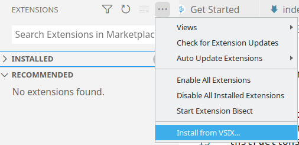

# Introduction to VSCodium
{::options toc_levels="2..6" /}

VSCodium is the name of Open Source Software Binaries of VS Code, a very powerful source code editor.

## Contents
{:.no_toc}
* A markdown (kramdown) generated TOC.
{:toc}

## Installation
VSCodium can be installed from https://vscodium.com/. Please follow the
instructions provided for your platform. If you do not have administrative
privileges on your computer, resort to a
[portable installation](https://portapps.io/app/vscodium-portable/) instead.

## Addons
After completing the setup, install addons to facilitate your tasks.
Some extensions are not available in the https://open-vsx.org/ extension
registry used by VSCodium. If you cannot find an extension there, download its
`vsx` file from any other marketplace and install it by selecting
`Install from VSIX`:

### Generic Addons

| Addon | Explanation |
| ----- | ----------- |
| Bracket Pair Colorizer 2 | A customizable extension for colorizing matching brackets |
| EditorConfig for VS Code | EditorConfig Support for Visual Studio Code |
| GitLens | Supercharge the Git capabilities built into Visual Studio Code |
| Path Autocomplete | Visual Studio Code plugin that autocompletes filenames. |
| Vim | VSCodeVim is a Vim emulator for Visual Studio Code |

### LaTeX

| Addon | Explanation |
| ----- | ----------- |
| LaTeX Workshop | Boost LaTeX typesetting efficiency with preview, compile, autocomplete, colorize, and more. |

### Python

| Addon | Explanation |
| ----- | ----------- |
| [Pico-Go](https://marketplace.visualstudio.com/items?itemName=ChrisWood.pico-go) | Autocompletion and a REPL console for the Raspberry Pi Pico. |
| Python | IntelliSense (Pylance), Linting, Debugging (multi-threaded, remote), Jupyter Notebooks, code formatting, refactoring, ... |

### Template Engines

| Addon | Explanation |
| ----- | ----------- |
| Better Jinja | Syntax highlighting for jinja(2) including HTML, Markdown, YAML, Ruby and LaTeX templates |
| [Nunjucks Template](https://marketplace.visualstudio.com/items?itemName=eseom.nunjucks-template) | Formatting, Syntax Highlighting, Hover, and Snippets for Nunjucks |

### Web Development

| Addon | Explanation |
| ----- | ----------- |
| Babel JavaScript | VSCode syntax highlighting for today's JavaScript |
| CSS Peek | Allow peeking to css ID and class strings as definitions from html files to respective CSS. |
| ESLint | Integrates ESLint JavaScript into VS Code. |
| Live Server | Launch a development local Server with live reload feature for static & dynamic pages. |

## Shortcuts

Shortcut | Action
-------- | ------
`Ctrl+p` | Search files by name
`Ctrl+p` `#` (`@`) | Go to symbol (in workspace)
`Ctrl+Shift+P`, `F1`, `Ctrl+p` `>` | Command Palette
``Crtl+` `` | Toggle Terminal
`Ctrl+Tab` | Switch between open documents
`Ctrl+\` | Toggle line comment

### Running and Debugging Code
These actions can be found in the `Run` menu.

Shortcut | Action
-------- | ------
`F5` | Start Debugging
`F5` | Continue
`F9` | Toggle Breakpoint
`F10` | Step Over
`F11` | Step Into
`Shift+F11` | Step Out

## Selected Commands
After activating the command palette via `F1` (see shortcuts above), you
can use, among others, the following commands.

| Command |
| --- |
| `Toggle Line Comment` |
| `Emmet: Wrap with Abbreviation` |
| `Emmet: Expand Abbreviation` |

## Configuration
To open the full configuration as JSON file, open the command palette via `F1`
and type `Preferences: Open Settings (JSON)`. To access the settings user
interface, open the command palette via `F1` and type
`Preferences: Open Settings (UI)`.

[//]: # (TODO: Add ## setting up VSCodium for C Programming including launch.json files)

[//]: # (TODO: Add ## Video Tutorial)
