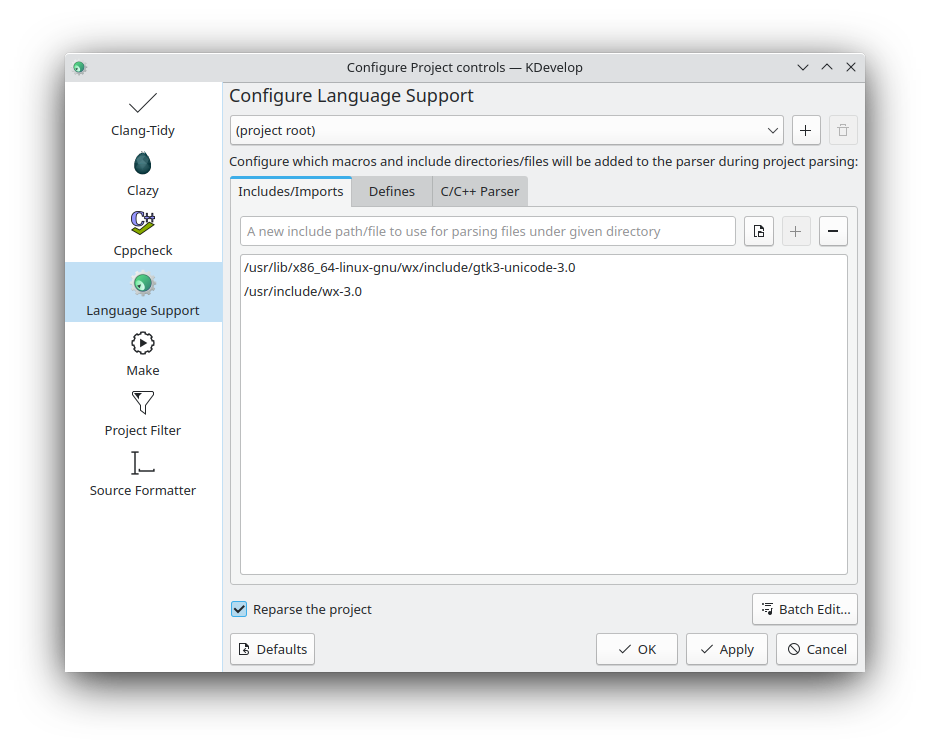
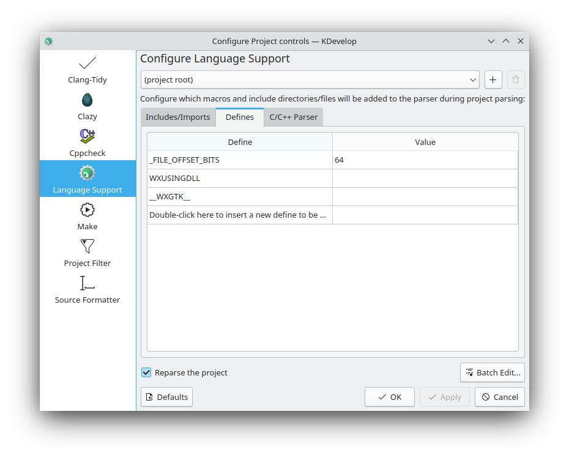

# Configure your IDE for wxWidgets

wxWidgets is natively supported by a number of IDEs. However, some of them
must be set up manually to be able to find the symbols declared in
wxWidgets headers. There are two reasons for this requirement:

* wxWidgets headers do not reside in the system's include paths but
  in a subdirectory thereof (display the includes via `cpp -v`).
* wxWidgets relies on pre-processor defines to determine details for
  compilation.

Both are generated by the `wx-config` shell script. Hence, one can use this
script to display the required values.

```
wx-config --cxxflags
```

On my system, the above yields
```
-I/usr/lib/x86_64-linux-gnu/wx/include/gtk3-unicode-3.0 \
-I/usr/include/wx-3.0 \
-D_FILE_OFFSET_BITS=64 \
-DWXUSINGDLL \
-D__WXGTK__ \
-pthread
```

The first two lines add the paths (after `-I`) to the list of directories
to be searched for header files. The lines starting with `-D` are preprocessor
macro definitions and get processed as if they appeared during translation
in a `#define` directive.

## KDevelop
To configure an existing KDevelop project
1. select `Project->Open Configuration...` from the menu
2. click on `Language Support` and add the include paths
  
3. switch to `Defines` and add all required entries
  

Make sure not to copy the values from my system but use the output created by  
`wx-config --cxxflags` on your own system.

The configuration is stored per project in the `.kdev` subdirectory.
Note that you have to set up this configuration manually in every wx project
when using Kdevelop.


## Generic Editors
To avoid errors about missing wx headers in most editors, you may want to
configure your shell's `CPLUS_INCLUDE_PATH` variable. This variable holds
additional include paths to be searched for header files. Add the paths
presented by `wx-config --cxxflags` to it, separated by a colon (`:`). In my
environment, this would be the appropriate command

```shell
export CPLUS_INCLUDE_PATH=${CPLUS_INCLUDE_PATH}:/usr/include/wx-3.2:/usr/lib/wx/include/gtk3-unicode-3.2
```

However, the above only affects the current shell and is not persisted.
To make the change persistent, edit your shell's login configuration. In case
of the bash shell, this configuration resides in `~/.profile`. Append the
following to it (but make sure to set the variables `GTK3_UNICODE` and
`WX` to match your system's output of `wx-config --cxxflags`).

```bash
# add libs to CPLUS_INCLUDE_PATH if they are installed
GTK3_UNICODE="/usr/lib/wx/include/gtk3-unicode-3.2"
if [ -d "${GTK3_UNICODE}" ] ; then
  CPLUS_INCLUDE_PATH="${CPLUS_INCLUDE_PATH}:${GTK3_UNICODE}"
fi
WX="/usr/include/wx-3.2"
if [ -d "${WX}" ] ; then
  CPLUS_INCLUDE_PATH="${CPLUS_INCLUDE_PATH}:${WX}"
fi
export CPLUS_INCLUDE_PATH

```


## Editors Supporting `compile_commands.json`
If your editor supports `compile_commands.json`, this file will be used
for automatically configuring code completion and other features for C/C++.
Generally, editors providing Language Server Protocol (LSP) implementations
like `clangd` will support this mechanism.
These include `emacs`, `kate`, `micro`, `neovim`, `vim`, `vscodium`
and others (although some require plugins for this to work).

Fortunately, `cmake` can be used to automatically create
`compile_commands.json` by setting
`set(CMAKE_EXPORT_COMPILE_COMMANDS ON)`. If this is turned on, all editors
supporting `clangd` via the LSP will automatically work well with wxWidgets
as soon as `cmake` was executed in the project.
