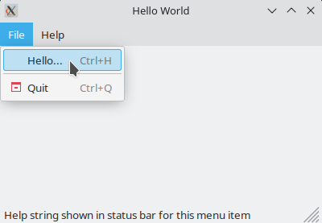

# Introduction to wxWidgets



[wxWidgets](https://www.wxwidgets.org/) is a leightweight GUI toolkit that is
primarily targeted for C++
but is also available for other languages including Python. It gives
applications a truly native look by using each platform's native API. 
wxWidgets is completely open source using the
[wxWidgets licence]({{ gh }}/blob/master/docs/licence.txt) which is
a more liberal version of the LGPL (allowing distribution without the source
code). It is very
[actively developed]({{ gh }}//pulse/monthly) and maintained and has good
support for all common programming environments. The source code is available
on the project's [Github page]({{ gh }}).

To get started, install the required dependencies

```
sudo apt install libwxgtk3.0-gtk3-dev
```

After the installation, follow the official
[Hello World Example]({{ wx }}overview_helloworld.html). Save your code to
`hello_wx.cpp`
To compile the example, type

```
clang++ hello_wx.cpp `wx-config --cxxflags --libs` -o hello_wx
```

Start your first GUI application by typing `./hello_wx`.



# Compile with GNU Make
wxWidgets files can, of course, also be compiled with GNU Make. Use the
source below as an example
```make

```
Download the above template [Makefile](Makefile).
