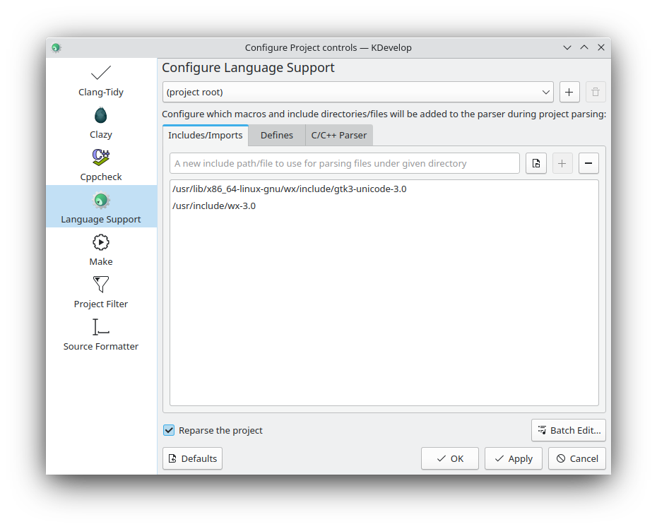
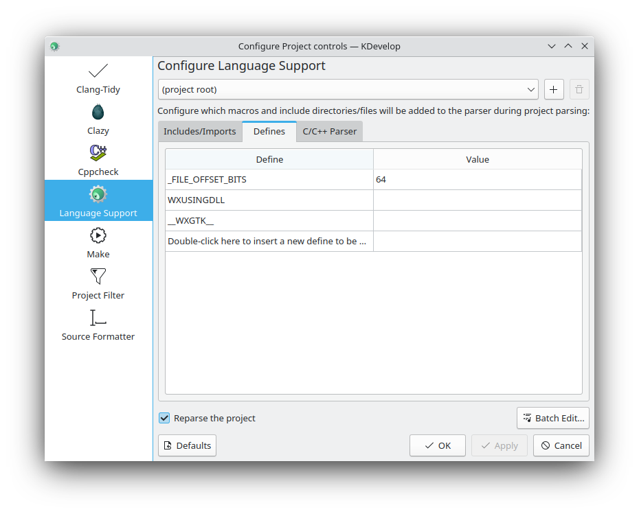

# Configure your IDE for wxWidgets

wxWidgets is natively supported by a number of IDEs. However, some of them
must be set up manually to be able to find the symbols declared in
wxWidgets headers. There are two reasons for this requirement:

* wxWidgets headers do not reside in the system's include paths but
  in a subdirectory thereof (display the includes via `cpp -v`).
* wxWidgets relies on pre-processor defines to determine details for
  compilation.

Both are generated by the `wx-config` shell script. Hence, one can use this
script to display the required values.

```
wx-config --cxxflags
```

On my system, the above yields
```
-I/usr/lib/x86_64-linux-gnu/wx/include/gtk3-unicode-3.0 \
-I/usr/include/wx-3.0 \
-D_FILE_OFFSET_BITS=64 \
-DWXUSINGDLL \
-D__WXGTK__ \
-pthread
```

The first two lines add the paths (after `-I`) to the list of directories
to be searched for header files. The lines starting with `-D` are preprocessor
definitions and get processed as if they appeared during translation
in a `#define` directive.

## KDevelop
To configure an existing KDevelop project
1. select `Project->Open Configuration...` from the menu
2. click on `Language Support` and add the include paths
  
3. switch to `Defines` and add all required entries
  

Make sure not to copy the values from my system but use the output created by  
`wx-config --cxxflags` on your own system.
